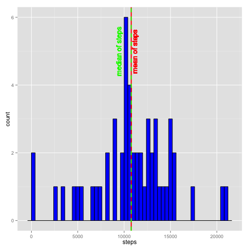
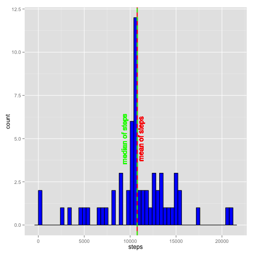
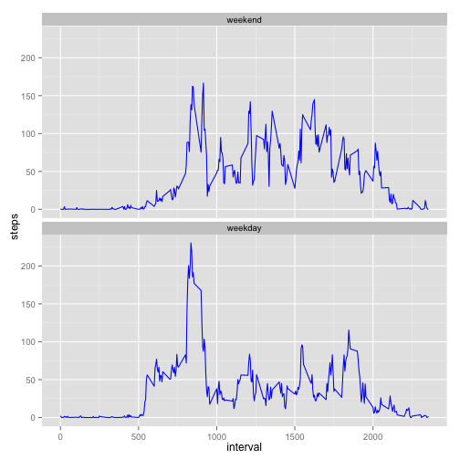

This study analyzes data from a Fitbit user over the course of two months, to determine average steps per day, what time of day the user was most active, and whether weekends were busier than weekdays.

You will need to install the ggplot2 package for this analysis, using the command:

install.packages("ggplot2")

You will be asked to chose a mirror site to obtain the package.
Then call up the package using library(ggplot2):


```r
library(ggplot2)
```
## Part 1:  What is the mean total number of steps taken per day?
### Create a histogram showing the distribution of number of steps per day, and calculate the mean and median of total number of steps per day.

First the data is downloaded.

```r
fileURL <- "https://d396qusza40orc.cloudfront.net/repdata%2Fdata%2Factivity.zip"
temp <- tempfile()
download.file(fileURL, temp, method = "curl")
```
Record the date and time of when the data was downloaded:

```r
dateDownloaded <- date()
dateDownloaded
```

```
## [1] "Sun Sep 20 10:57:48 2015"
```
This data was downloaded on Sun Sep 20 10:57:48 2015.

Then read into R using the following code to unzip and read, and create data frame "fit_data":


```r
fit_data <- read.csv(unz(temp,"activity.csv"))
unlink(temp)
```

Subset the data frame to eliminate records with "NA" steps:


```r
remove_nas <- fit_data[complete.cases(fit_data), ]
```
Then sum up the steps for each day using the aggregate function, and look at first ten rows
and dimensions to make sure it is correct:

```r
sum_steps <- aggregate(steps ~ date, data = remove_nas, sum)
head(sum_steps)
```

```
##         date steps
## 1 2012-10-02   126
## 2 2012-10-03 11352
## 3 2012-10-04 12116
## 4 2012-10-05 13294
## 5 2012-10-06 15420
## 6 2012-10-07 11015
```

```r
dim(sum_steps)
```

```
## [1] 53  2
```
Note that the first day's data is missing. That's because the steps for the first day were not recorded, or were "NA", and were removed from this data set.

Now plot the histogram of daily steps, and add vertical lines showing mean and median:

```r
p <- ggplot(sum_steps, aes(x = steps))
p <- p + geom_histogram(binwidth = 400, color = "black", fill = "blue")
p <- p + geom_vline(aes(xintercept = mean(steps)), color = "red", linetype = "solid", size = 1)
p <- p + geom_text(aes(x = mean(steps), label = "mean of steps", y = 5), color = "red", angle = 90, vjust = 1.2)
p <- p + geom_vline(aes(xintercept = median(steps)), color = "green", linetype = "dashed", size = 1)
p <- p + geom_text(aes(x = mean(steps), label = "median of steps", y = 5), color = "green", angle = 90, vjust = -2)
p
```

 

Since the mean (red solid line) and median (green dashed line) are so close together, it is difficult to distinguish between the two on the plot.  So print the values:

```r
mean(sum_steps$steps)
```

```
## [1] 10766
```

```r
median(sum_steps$steps)
```

```
## [1] 10765
```
The mean and median are indeed very close to each other. 

## Part 2: What is the average daily activity pattern?
### Make a time series line plot of the steps taken during each interval, averaged across all of the days, and find the maximum.

Still using the interval_avg data frame, which excludes NAs from the original data frame, we are now looking for the average for each interval across all of the days.

For this, we will calculate the average steps per interval using the aggregate function again:


```r
interval_avg <- aggregate(steps ~ interval, data = remove_nas, mean)
```
Next, another column was added to the data frame to show actual time of day for each interval:

```r
temp <- c(interval_avg$interval)
temp2 <- mapply(function(x, y) paste0(rep(x, y), collapse = ""), 0, 4 - nchar(temp))
temp <- paste0(temp2, temp)
interval_avg$time <- format(strptime(temp, format = "%H%M"), format = "%H:%M%p")
```
And the first ten rows of the result are:

```
##   interval   steps    time
## 1        0 1.71698 00:00AM
## 2        5 0.33962 00:05AM
## 3       10 0.13208 00:10AM
## 4       15 0.15094 00:15AM
## 5       20 0.07547 00:20AM
## 6       25 2.09434 00:25AM
```
So now the actual time of day is available.

The busiest time of day is calculated, and the whole row is returned:

```r
busiest <- interval_avg[which.max(interval_avg$steps), ]
busiest
```

```
##     interval steps    time
## 104      835 206.2 08:35AM
```
The last step is to draw a line plot showing average steps per time interval, and to show the interval with the maximum, or peak average number of steps:

```r
p <- ggplot(interval_avg, aes(x = interval, y = steps, group = 1)) 
p <- p + geom_line(color = "blue")
p <- p + geom_hline(aes(yintercept = max(steps)), color = "red", linetype = "dashed", size = 1, label = "Maximum Average")
p <- p + annotate("text", x = busiest$interval + 100, y = busiest$steps, label = paste("Average Peak Steps Occur at Interval", busiest$interval, "(",busiest$time,")"), vjust = 2)
p
```

 

We can see that the most steps on average occurred in the morning at the five minute interval ending at 8:35AM.

## Part 3: Input missing values.
### The presence of missing values in the origianl dataset might introduce some bias in the analysis if they are excluded from the data. So the original dataset is used here, with the NAs in steps replaced with the mean number of steps for that interval from the other days.

First, let's review the dimensions of the original data frame:

```r
dim(fit_data)
```

```
## [1] 17568     3
```

Knowing that there are 17568 records in the data frame fit_data, including the NAs, we determine how many records have NAs:

```r
rows_na <- nrow(subset(fit_data, is.na(steps)))
rows_na
```

```
## [1] 2304
```
2304 out of 17568 could be significant.  So we will take the average steps for each interval that is not missing, and replace the NAs with the time interval average steps.

First we will copy the fit_data data frame into a new data frame called fit_data2, to preserve the original.

```r
fit_data2 <- fit_data
```
Loop through the first column to find NAs for steps taken, and replace with mean steps for that interval from the other days, from interval_avg dataframe.

```r
for(i in 1:nrow(fit_data2)){
        fit_data2[i, 1] <- ifelse(is.na(fit_data2[i, 1]) == TRUE, interval_avg[interval_avg$interval == fit_data2[i, 3], 2], fit_data2[i, 1])
}
```
With the NAs replaced, recalculate the sum of steps for each date using aggregate function:

```r
sum_steps2 <- aggregate(steps ~ date, data = fit_data2, sum)
```
and plot histogram.

```r
p <- ggplot(sum_steps2, aes(x = steps)) 
p <- p + geom_histogram(binwidth = 400, color = "black", fill = "blue")
p <- p + geom_vline(aes(xintercept = mean(steps)), color = "red", linetype = "solid", size = 1)
p <- p + geom_text(aes(x = mean(steps), label = "mean of steps", y = 5), color = "red", angle = 90, vjust = 1.2)
p <- p + geom_vline(aes(xintercept = median(steps)), color = "green", linetype = "dashed", size = 1)
p <- p + geom_text(aes(x = mean(steps), label = "median of steps", y = 5), color = "green", angle = 90, vjust = -2)
p
```

 

Did replacing the NAs with averages affect the mean and median steps? The mean and median are still right on top of each other, so we should look at the computations.

The mean number of steps excluding the NAs was 10766.  
The mean number of steps with NAs replaces with means was 10766.

The median number of steps excluding the NAs was 10765.  
The median number of steps with NAs replaces with means was 10766.

Since we replaced the NA steps with means, then the mean did not change. Medians changed only slightly. Had the NAs been replaced with zeros, the results would have been different.

## Part 4: Are there differences in activity patterns between weekdays and weekends?
### Create a panel plot which will compare the average weekday activity with the average weekend activity by time interval.

The data frame fit_data2 will be re-used.  It has the NAs replaced with interval averages from all days.  It would be better to separate weekends and weekdays, and then take the inverval averages, but that was not done here.

First, review the stucture of the fit_data2 data frame:


```r
str(fit_data2)
```

```
## 'data.frame':	17568 obs. of  3 variables:
##  $ steps   : num  1.717 0.3396 0.1321 0.1509 0.0755 ...
##  $ date    : Factor w/ 61 levels "2012-10-01","2012-10-02",..: 1 1 1 1 1 1 1 1 1 1 ...
##  $ interval: int  0 5 10 15 20 25 30 35 40 45 ...
```
And look at first ten rows:

```r
head(fit_data2)
```

```
##     steps       date interval
## 1 1.71698 2012-10-01        0
## 2 0.33962 2012-10-01        5
## 3 0.13208 2012-10-01       10
## 4 0.15094 2012-10-01       15
## 5 0.07547 2012-10-01       20
## 6 2.09434 2012-10-01       25
```
We need to change the date column from factors to dates, and verify:


```r
fit_data2$date <- as.Date(fit_data2$date)
str(fit_data2)
```

```
## 'data.frame':	17568 obs. of  3 variables:
##  $ steps   : num  1.717 0.3396 0.1321 0.1509 0.0755 ...
##  $ date    : Date, format: "2012-10-01" "2012-10-01" ...
##  $ interval: int  0 5 10 15 20 25 30 35 40 45 ...
```

Now that dates are in date format, add a column to the fit_data2 data frame, name it "day_type", and populate that column with "weekday" or "weekend" as factors.

```r
weekdays1 <- c("Monday", "Tuesday", "Wednesday", "Thursday", "Friday")
fit_data2$day_type <- factor((weekdays(fit_data2$date) %in% weekdays1), 
                   levels=c(FALSE, TRUE), labels=c("weekend", "weekday"))
```
Look at first few rows to see the result:

```
##     steps       date interval day_type
## 1 1.71698 2012-10-01        0  weekday
## 2 0.33962 2012-10-01        5  weekday
## 3 0.13208 2012-10-01       10  weekday
## 4 0.15094 2012-10-01       15  weekday
## 5 0.07547 2012-10-01       20  weekday
## 6 2.09434 2012-10-01       25  weekday
```
We can also add the day of the week in another column, based on the date information.  Just to verify that the day_type is consistent with the day of the week if needed.

```r
fit_data2$dayofweek <- weekdays(fit_data2$date)
head(fit_data2)
```

```
##     steps       date interval day_type dayofweek
## 1 1.71698 2012-10-01        0  weekday    Monday
## 2 0.33962 2012-10-01        5  weekday    Monday
## 3 0.13208 2012-10-01       10  weekday    Monday
## 4 0.15094 2012-10-01       15  weekday    Monday
## 5 0.07547 2012-10-01       20  weekday    Monday
## 6 2.09434 2012-10-01       25  weekday    Monday
```
Now take the interval step averages, aggregated by interval and day_type (weekday or weekend). Call it inverval_avg2).


```r
interval_avg2 <- aggregate(steps ~ interval + day_type, data = fit_data2, mean)
```
A panel plot of weekend and weekday activity profiles, using ggplot, looks like this:

```r
p <- ggplot(interval_avg2, aes(x = interval, y = steps, group = 1)) 
p <- p + geom_line(color = "blue")
p <- p + facet_wrap(~ day_type, ncol = 1)
p
```

 

It looks as though the subject was active early on weekdays, with less activity during the day, suggesting a commute to work or school, at least partially on foot, in a tight time schedule. The return home either involved less walking, or the departure time was more variable. By comparison, the weekend activity was more evenly spread over the day, and later into the night.
